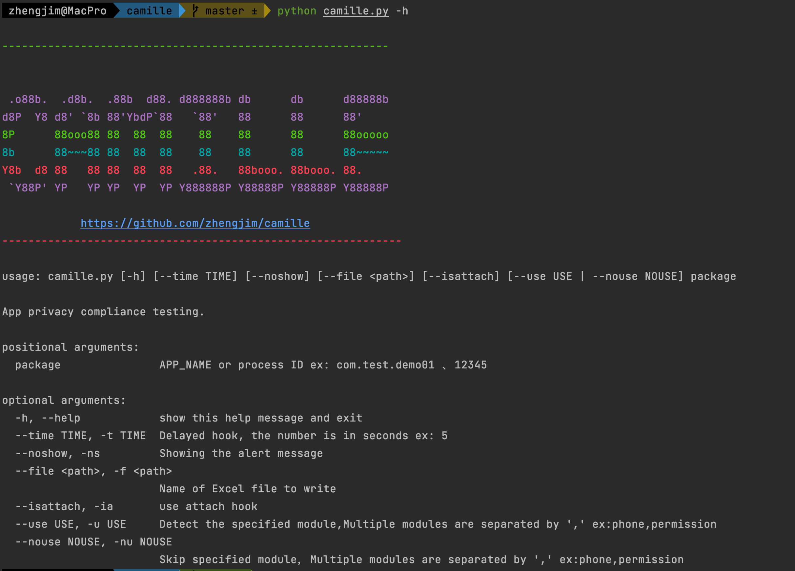

# Camille

Android App隐私合规检测辅助工具

## 简介

现如今APP隐私合规十分重要，各监管部门不断开展APP专项治理工作及核查通报，不合规的APP通知整改或直接下架。camille可以hook住Android敏感接口，检测是否第三方SDK调用。根据隐私合规的场景，辅助检查是否符合隐私合规标准。

## 隐私合规资料及政策

[隐私资料政策wiki](https://github.com/zhengjim/camille/wiki)

## 安装

环境：

python3、frida 、一台已root手机(我测试机为Redmi 3s，刷机成魔趣Android 8.1，感觉问题挺多的)，并在手机上运行`frida-server`。

测试了Android 8.1(还测试了魔趣Android 10)，其他版本安卓可能会有bug。

更新日志：

```
2022-12-12：修复android 13有兼容性问题

2022-11-25：修复截图bug、优化hook方法支持传参数过滤

2022-11-21：新增可指定frida-server用于对抗frida检测，参数-H、修复模拟器没有sdcard目录报错问题

2022-11-16：感谢@ysrfeng 添加wiki，添加隐私合规相关资料和政策文档。

2022-11-15：合并@RebornQ PR，新增多设备可指定设备功能

2022-11-11：修复Android7报错、Frida12报错、优化异常处理便于排查

2022-11-10: 合并@RebornQ PR、修复部分问题、优化初始化异常提示

2022-11-03: 添加同意隐私合规状态(需人工确认)、第三方SDK识别、可hook构造函数，`methodName`传`'$init'`。方便大家交流，创建交流群。 新增文件接口，感谢@LiuXinzhi94提供。 新增敏感接口，感谢群里师傅@WYY提供

2022-10-26：新增支持加载外部脚本文件，填相对路径或绝对路径均可（用于 pyinstaller 打包二进制执行文件后使用）感谢@RebornQ pr

2022-09-07：添加讨论群，新增敏感接口，感谢群里师傅@410提供。

2022-07-08: 默认不开启绕过TracerPid,添加attach hook，避免有些加固包不能hook问题。

2022-06-22：修复程序异常退出、冗余度高、hook接口不全有遗落、新增多个Android版本接口；封装hook方法，新增用户自定义hook方法。

2022-01-14：删除hook短信接口。新增：可指定模块hook或不hook哪些模块。默认不传，全扫描。
```

下载：

```
git clone https://github.com/zhengjim/camille.git
cd camille
pip install -r requirements.txt
python camille.py -h
```



## 用法

[使用说明文档](docs/use.md)

## 后记

本来想使用uiautomator2或appium来模拟点击制定场景，~~但后续调研发现纯自动化的检测是不全的，最多也就检测20-30%，还是得结合人工来检测。索性就删除了模拟点击这块。~~(其实就是懒，不定期更新)

## 场景

[百度史宾格的检测场景](docs/detection_scene.md)

## 参考链接

- https://github.com/Dawnnnnnn/APPPrivacyDetect
- https://github.com/r0ysue/r0capture/
- https://github.com/ChenJunsen/Hegui3.0

## 讨论群

感谢[@You-guess-guess](https://github.com/You-guess-guess) 提供的App合规检测交流群，有需要的可以加群交流~

为方便大家交流，创建交流群有需要的加群。后续过期加V(群满200，需要的加V)，备注github。就会拉进群。


## Stargazers over time

[](https://www.zhengjim.com)

[](https://starchart.cc/zhengjim/camille)


