# 目录

* [使用](#使用)
* [输出堆栈信息文件](#输出堆栈信息文件)
* [延迟hook](#延迟hook)
* [使用attach hook](#使用attach)
* [选择Hook模块](#选择Hook模块)
* [指定设备](#指定设备)
* [自定义hook接口](#自定义hook接口)
* [是否同意隐私政策](#是否同意隐私政策)
* [PyInstaller 打包二进制可执行文件](#PyInstaller打包二进制可执行文件)

# 使用：

```
python camille.py com.zhengjim.myapplication
```

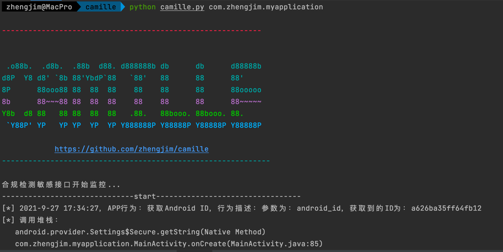

`com.zhengjim.myapplication`为测试app的包名，会显示时间、行为和调用堆栈。可以根据场景来判断是否合规，如：获取敏感信息是否是在同意隐私政策之前等。

# 输出堆栈信息文件

```
python camille.py com.zhengjim.myapplication -ns -f demo01.xls
```

- -ns：不显示日志。默认显示
- -f： 保存app行为轨迹(堆栈信息)到execl里。默认不保存。

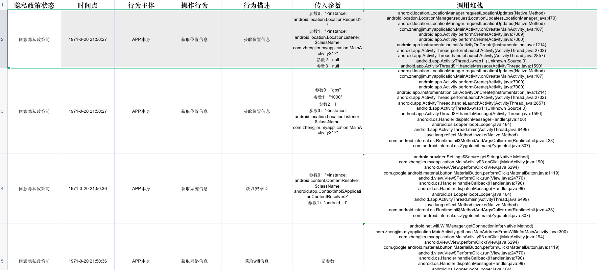

# 延迟hook

```
python camille.py com.zhengjim.myapplication -t 3
```

- -t： hook应用自己的函数或含壳时，建议使用setTimeout并给出适当的延时(1-5s，需要根据不同app进行调整)。以免hook失败。默认不延迟。

如下图：不加延迟hook失败。

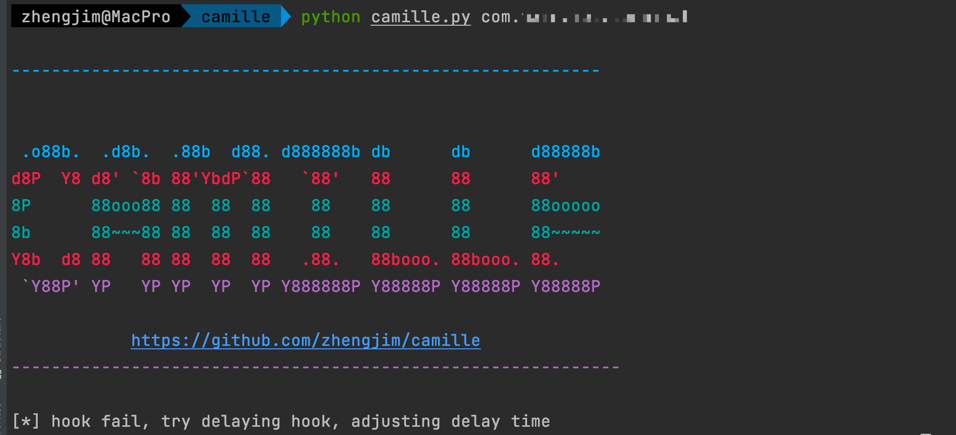

加了延迟hook成功。

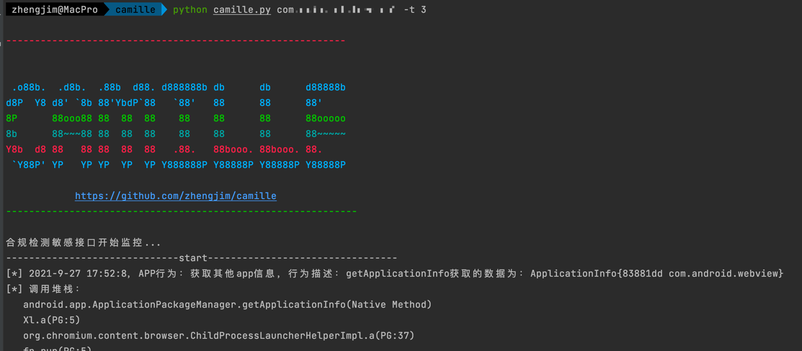

# 使用attach

- -ia：使用attach hook

假如还是hook不上，可以使用`-ia`，指定包名或运行进程ID。 有些包有同名进程，frida会hook失败，需要使用进程ID。

找进程ID，进入安卓运行`ps -A | grep com.zhengjim.myapplication`

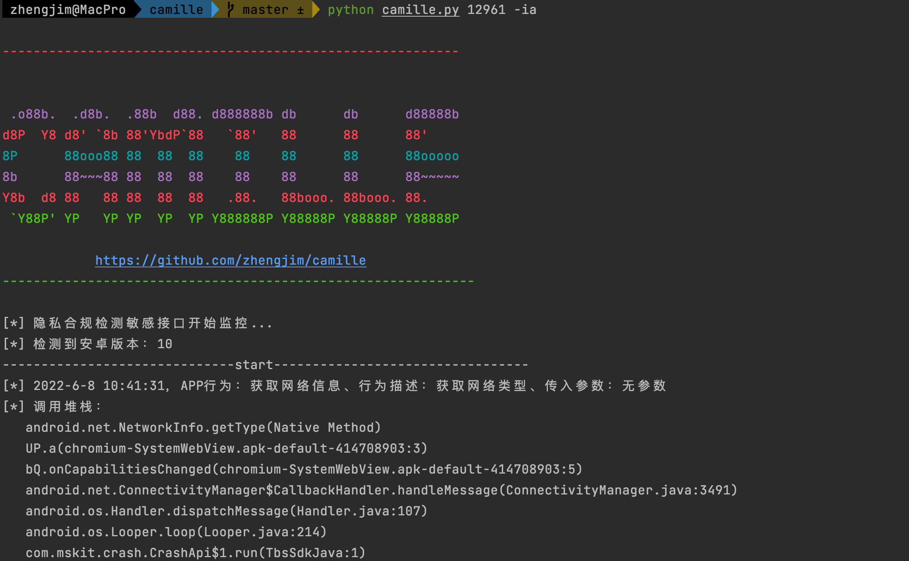

# 选择Hook模块

- -u： 扫描指定模块。与命令`-nu`互斥。多个模块用','隔开。例如：phone,permission

**模块列表：**

| 模块名 | 备注 |
| ------ | ------ |
|permission|申请权限|
|phone|电话、基站|
|system|系统信息(AndroidId/标识/content敏感信息)|
|app|其他app信息|
|location|位置信息|
|network|getNetwork|
|camera|照相机|
|bluetooth|蓝牙|
|file|文件|
|media|麦克风|
|custom| 用户自定义接口|

- -nu：跳过扫描指定模块。与命令`-u`互斥。多个模块用','隔开。例如：phone,permission 模块列表同上

# 指定设备

```
python camille.py com.zhengjim.myapplication -s emulator-5556
```

- -s：指定连接设备，可通过 `adb devices` 获取设备 id

# 自定义hook接口

在`script.js`文件里的`customHook`方法里可自行添加需要hook的接口。

如hook`com.zhengjim.myapplication.HookTest`类的`getPassword`和`getUser`方法。如下：

```
hook('com.zhengjim.myapplication.HookTest', [
    {'methodName': 'getPassword', 'action': action, 'messages': '获取zhengjim密码'},
    {'methodName': 'getUser', 'action': action, 'messages': '获取zhengjim用户名'},
]);
```

`-u custom`是只检测自定义接口，如图：
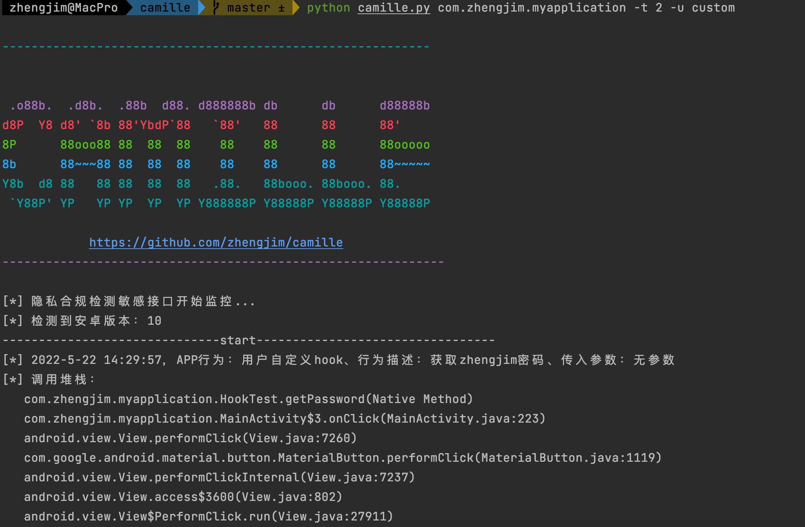

# 是否同意隐私政策

**手机设置要打开USB模拟按键点击开关**

默认开启， 如不需要改功能加`-npp` 参数关闭（不开启的话就默认是同意隐私合规后）。采用半自动模式，启动后会弹出当前屏幕。

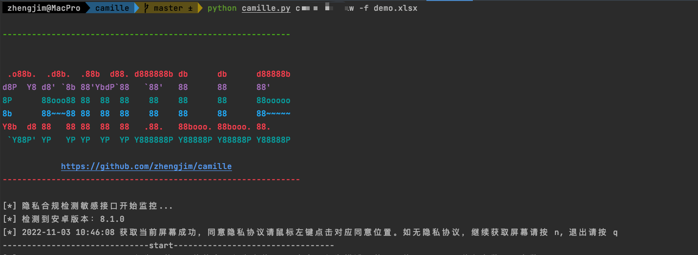

同意隐私协议请`鼠标左键`点击对应同意位置如无隐私协议，如不是隐私协议界面继续获取屏幕请按键盘`n`, 退出请按`q`

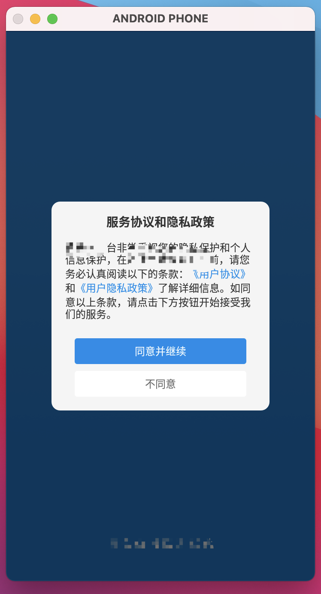

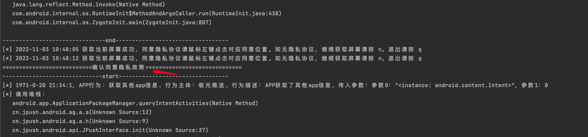

查看报告

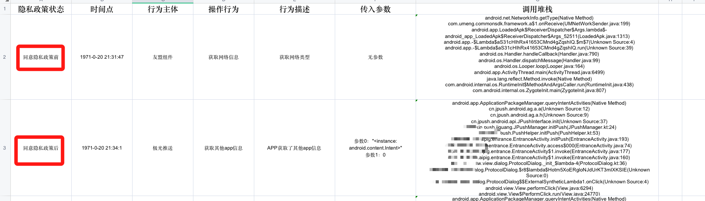

# 指定Frida-sever

- -H: 指定Frida-sever

对抗Frida检测，换端口启动，配合[hluda server](https://github.com/CrackerCat/strongR-frida-android) 使用，可过很多检测。hluda server更改了frida的很多特征。

服务端：
```
./hlu15 -l 0.0.0.0:30000
# 转发端口
adb forward tcp:30000 tcp:30000
```

使用：
```
python camille.py com.zhengjim.myapplication -H 127.0.0.1:30000
```

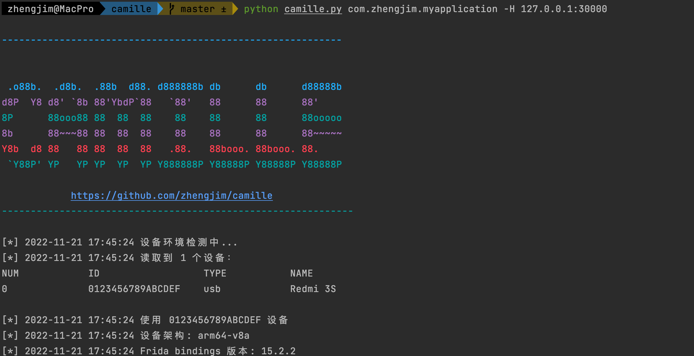


# PyInstaller打包二进制可执行文件

目前仅在 Windows 下测试过，其他平台请自行测试能否正常使用~

```shell
pyinstaller -F .\camille.py -p .\venv\Lib\site-packages\ -i .\images\icon.ico --add-data "script.js;." --add-data "utlis\sdk.json;.\utlis"
```

**可能出现的问题：**

ImportError: DLL load failed while importing _frida: %1 不是有效的 Win32 应用程序。

**解决方案：**

切换项目所用的 Python 环境为 32 位，移除 venv 后重新初始化项目环境为 Python 32 位即可。

**问题原因：**

这是 PyInstaller 与项目环境不一致的问题。

我安装 PyInstaller 的时候，系统的 Python 环境是 32 位，导致 PyInstaller 也是 32 位。

后来装了 64 位的 Python，这个项目环境初始化就是用 64 位 Python，环境冲突导致了这个问题。